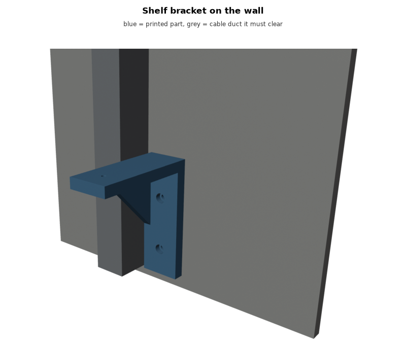
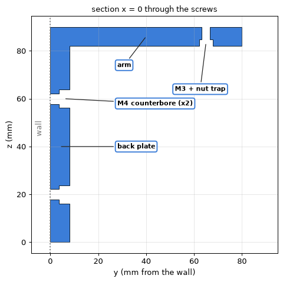
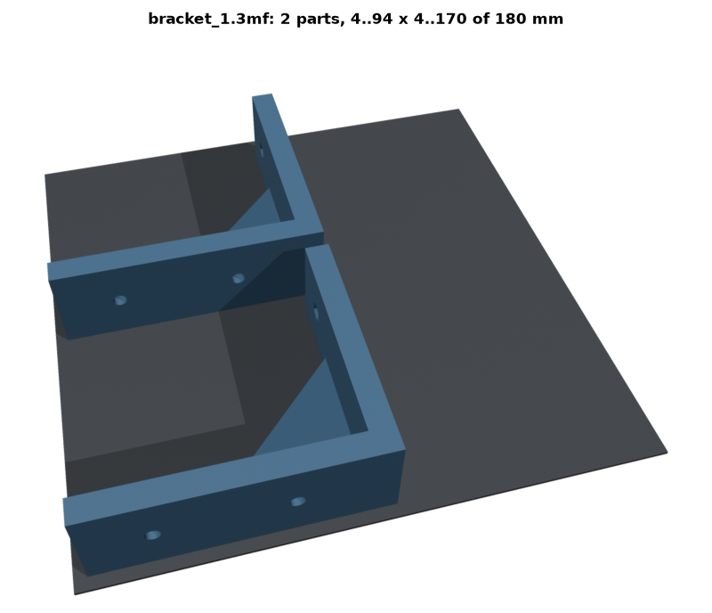

# agent_skills

Skills for coding agents (Claude Code and anything that reads `SKILL.md` folders) for **designing things that get
3D-printed and built by hand**. They document the tools and scripts that have worked in practice: parametric
Python generators, numeric checks before anything is printed, headless Blender renders, print-plate layout, and
turning meshes and photos into templates and reliefs.

| skill | for |
|---|---|
| [`print-part`](skills/print-part/SKILL.md) | parametric FDM parts: trimesh + manifold3d + shapely as uv scripts, the checks (bed fit, watertight, bodies, clash volume, bolt axes, screw length), plates, fasteners, jigs, splitting big parts |
| [`blender-render`](skills/blender-render/SKILL.md) | headless Blender (workbench) renders from a JSON manifest, with every part labelled by name: assemblies, before/after steps, plates on the bed |
| [`mesh-to-physical`](skills/mesh-to-physical/SKILL.md) | a mesh -> 1:1 contour templates on A3; a photo -> depth map -> printable relief |
| [`device-mold`](skills/device-mold/SKILL.md) | a printed cradle / mould / stand for existing devices, built from their spec sheets and manual drawings: drop-in pockets, cable furrows and port bays, an example cable clip (and other ways to hold cables), metal profiles in tunnels with break-away supports, fit tests first |
| [`painted-character`](skills/painted-character/SKILL.md) | a sculpted character from a reference painting to a textured mesh: SculptGL round trips, the painting's face imprinted and pasted, image-model repaints warped onto the silhouettes, features morphed onto the sculpt, eye variants from any picture |

## Install

Copy (or symlink) the folders under `skills/` into your agent's skill directory, e.g. for Claude Code:

```bash
git clone https://github.com/tomana/agent_skills
ln -s "$PWD/agent_skills/skills/"* ~/.claude/skills/          # all projects
# or: into <project>/.claude/skills/ for one project
```

Requirements: [uv](https://docs.astral.sh/uv/) (every script is a self-contained `uv run --script`), and
[Blender](https://www.blender.org/) for renders (`BLENDER=/path/to/blender` or `blender` on PATH).

## Try it

```bash
cd skills/print-part/scripts
./example_bracket.py --out /tmp/bracket --render
```

A wall shelf bracket, built from named parameters, checked, laid out on two plates and rendered with its parts and features labelled:

```
bracket (world):   30.0 x   80.0 x  90.0  watertight True  bodies 1  fits 180 bed True
clash with the duct: none   (a 12 mm wider bracket: 4912 mm3 - the check works)
M4 at z 20: axis open True, solid beside it True
M3 lengths (board 18 + arm above the nut): [(30, 6.7)]
plate bracket_1.3mf: 2 parts  4.0..94.0 x 4.0..170.0  overlap 0.00 mm3  (180 bed: OK)
```



Every part and feature under discussion carries its name - the same name in the picture, the file names, the
docs and the chat, so "the M3 + nut trap" means one thing to the person and the agent.

| section through the screws | plate, parts named as in the 3mf |
|---|---|
|  |  |

## The idea in one paragraph

A part is a script, not a file. Every dimension is named; the script rebuilds the part, **prints its checks**
(including a deliberately wrong variant to prove the clash check bites), writes STL + one 3mf per plate, and
renders pictures for the person who will print it. Iterating is: change a number, run, look at the picture.
The person slices and prints; the agent never hands over G-code it can't see.

MIT licensed.
